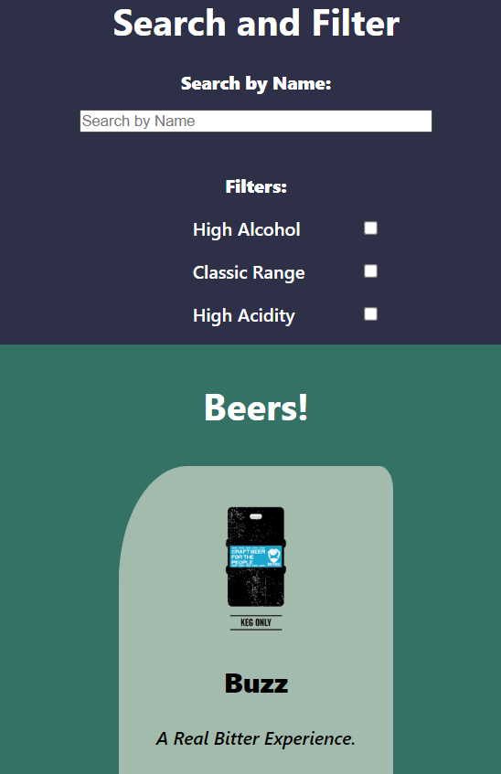

# Beers!

This is my version of the beers project completed during the _Nology_ full stack development course.

This was built using react and the Punk API.

PunkAPI can be found here: https://punkapi.com/

The aim of the project is to demonstrate the following:
- API Requests
- React Containers, Components, useState, useEffect and props (including functions as props)

The application displays cards showing the information from the beers which are retrieved from PunkAPI. The application is capable of:
- Searching by the name of the beers
- Selecting only the beers which have a high alcohol content (Greater than 6%)
- Selecting only the beers which are part of the "Classic" range (brewed before 2010)
- Selecting only the beers whch have a high acidity (pH less than 4)

### Here is the mobile version: 

)

### Here is the desktop version:

